# ElasticSearch

ElasticSearch筆記


# 基本概念

## index(索引)

相當於mysql的Database

## Type(類型)

類似於mysql的table

## Document(文檔)

類似於mysql中的某個table裡面的內容

## 倒排索引機制

# ElasticSearch官網

https://www.elastic.co/


中文文檔

https://www.elastic.co/guide/cn/elasticsearch/guide/current/index.html

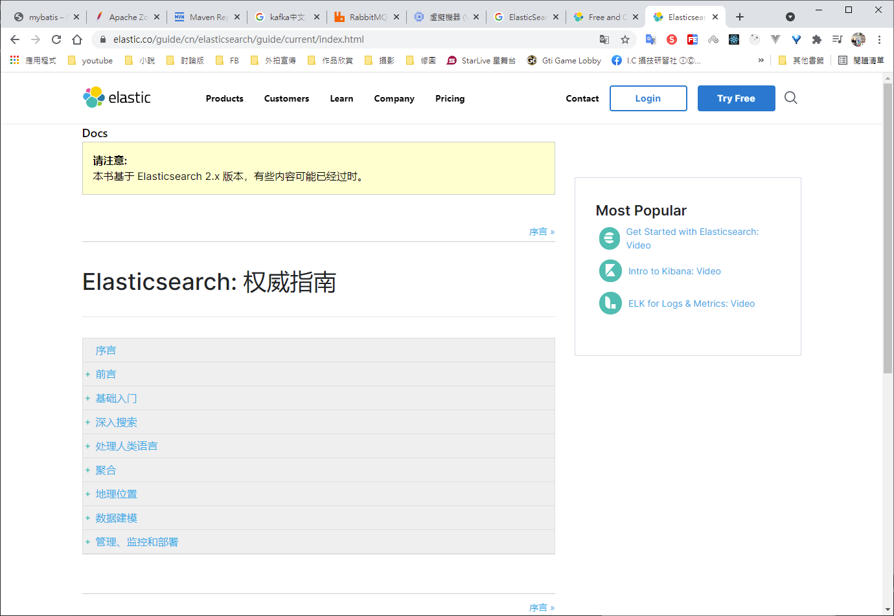

# Kibana官網

https://www.elastic.co/kibana/


中文版官網

https://www.elastic.co/cn/kibana/


# Docker倉庫官網

要安裝的鏡像可以在這裡搜尋安裝的指令、版本

https://hub.docker.com/

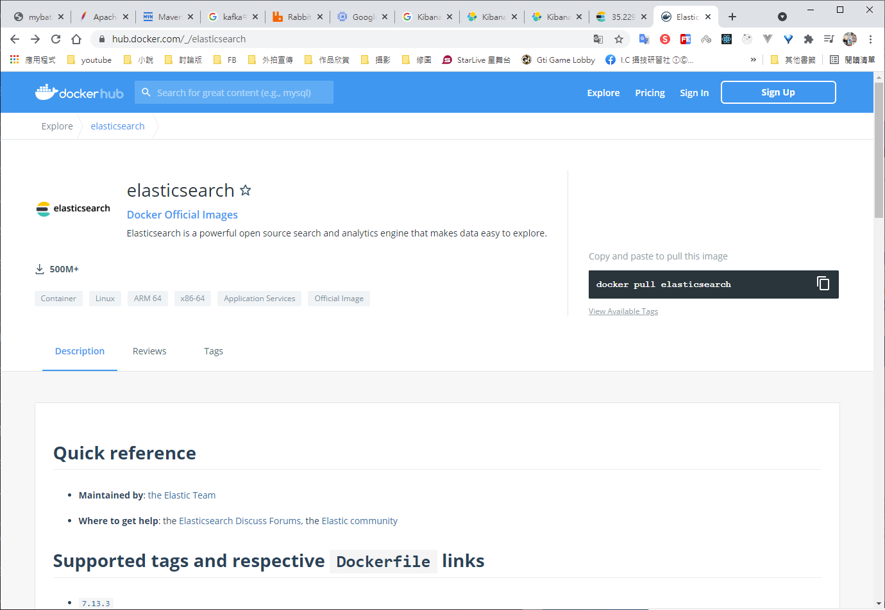

# 使用Docker安裝ElasticSearch

必須先安裝docker

可以參考之前的文章

https://github.com/IvesShe/DockerStudy

docker安裝完成

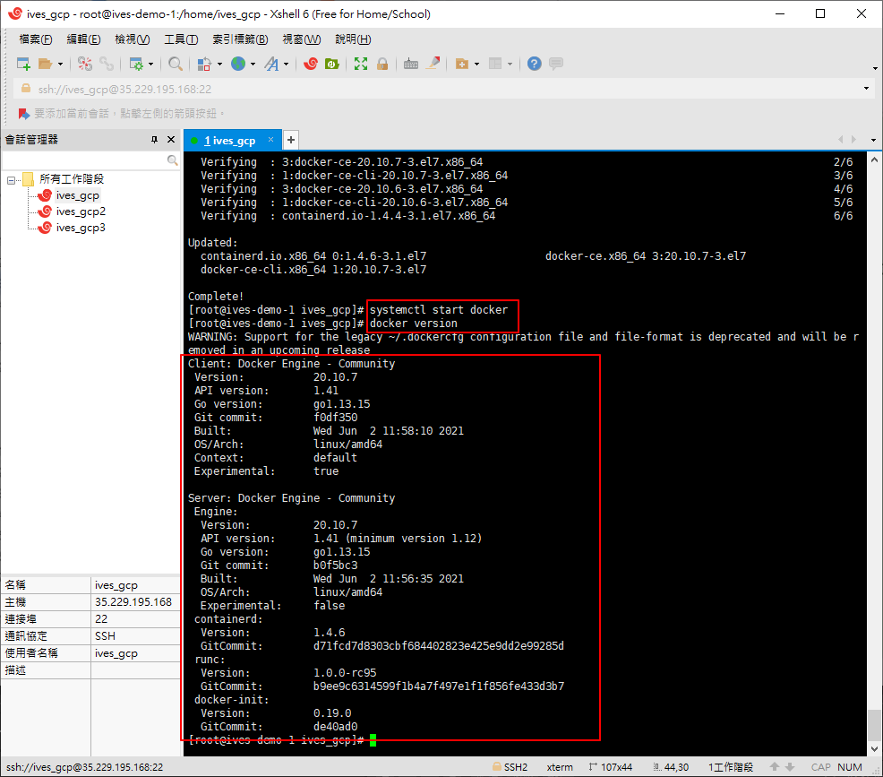

# 下載鏡像文件

```bash
# 存儲和檢索數據
docker pull elasticsearch:7.4.2
```

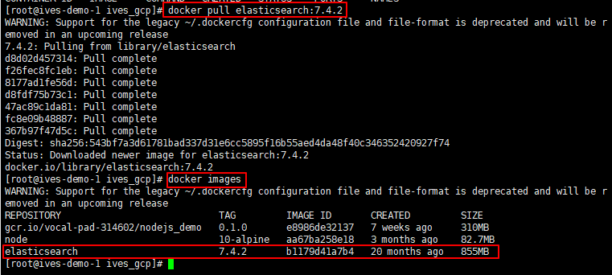

```bash
# 可視化檢索數據
docker pull kibana:7.4.2
```

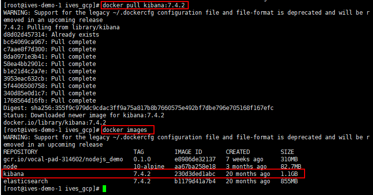

檢查一下目前記憶體使用狀態

```bash
free -m
```


# 創建實例-安裝ElasticSearch

建立資料夾及文件
```bash
mkdir -p /mydata/elasticsearch/config

mkdir -p /mydata/elasticsearch/data

mkdir -p /mydata/elasticsearch/plugins

echo "http.host:0.0.0.0">>/mydata/elasticsearch/config/elasticsearch.yml
```


設定資料夾權限(重要!!!未設置會導致下面的指令啟動失敗)

chmod -R 777 /mydata/elasticsearch/


創建elasticsearch

```bash
docker run --name elasticsearch -p 9200:9200 -p 9300:9300 \
-e "discovery.type=single-node" \
-e ES_JAVA_OPTS="-Xms64m -Xmx512m" \
-v /mydata/elasticsearch/data:/usr/share/elasticsearch/data \
-v /mydata/elasticsearch/plugins:/usr/share/elasticsearch/plugins \
-d elasticsearch:7.4.2
```


這邊的指令會失敗，不知為何無法掛載config，原因待查，先使用上面的(在這邊卡很久)

```bash
docker run --name elasticsearch -p 9200:9200 -p 9300:9300 \
-e "discovery.type=single-node" \
-e ES_JAVA_OPTS="-Xms64m -Xmx512m" \
-v /mydata/elasticsearch/config/elasticsearch.yml:/usr/share/elasticsearch/config/elasticsearch.yml \
-v /mydata/elasticsearch/data:/usr/share/elasticsearch/data \
-v /mydata/elasticsearch/plugins:/usr/share/elasticsearch/plugins \
-d elasticsearch:7.4.2
```

## 常用指令

進入容器

```bash
docker exec -it aaf5f204b951 /bin/bash
```

```bash
docker rm -f $(docker ps -aq)   #刪除所有容器
```

# 開啟GCP防火牆9200端口

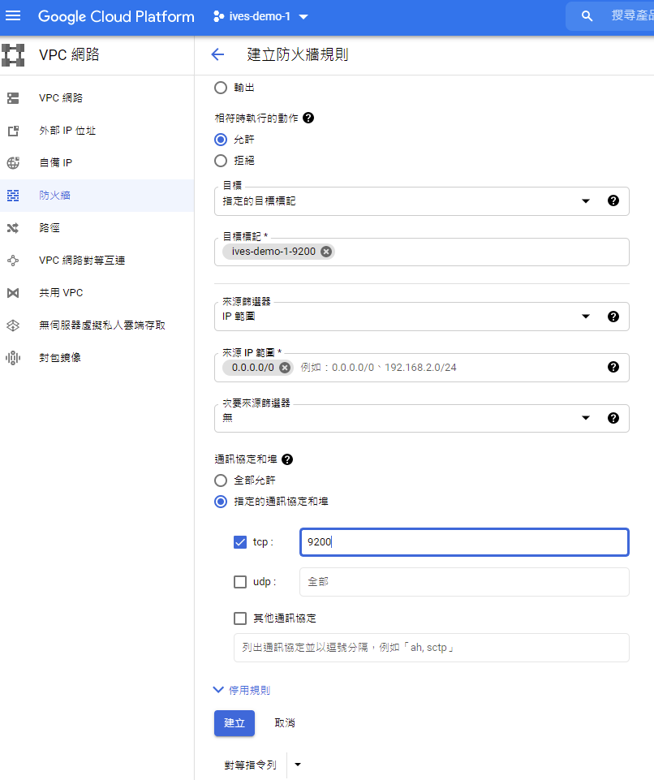

# 成功訪問elasticsearch

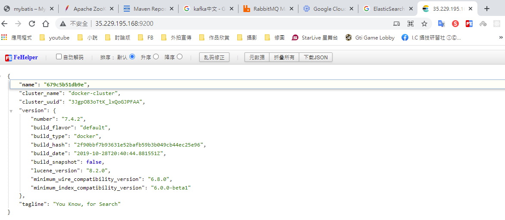

# 使用postman訪問elasticsearch

http://35.229.195.168:9200

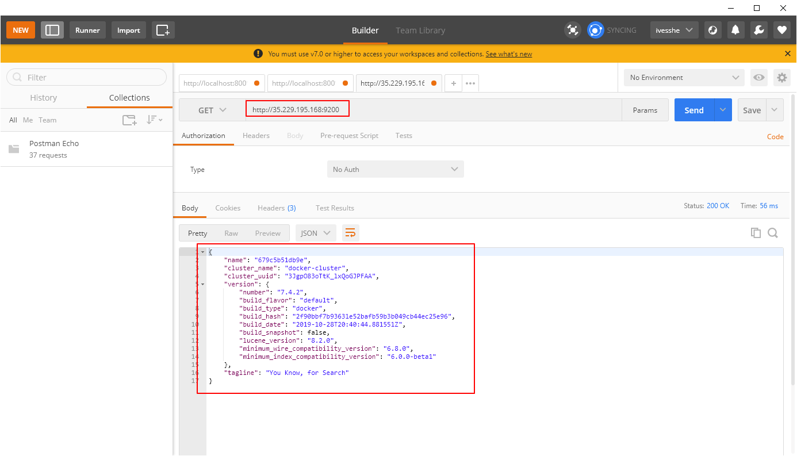

查看節點信息

http://35.229.195.168:9200/_cat/nodes

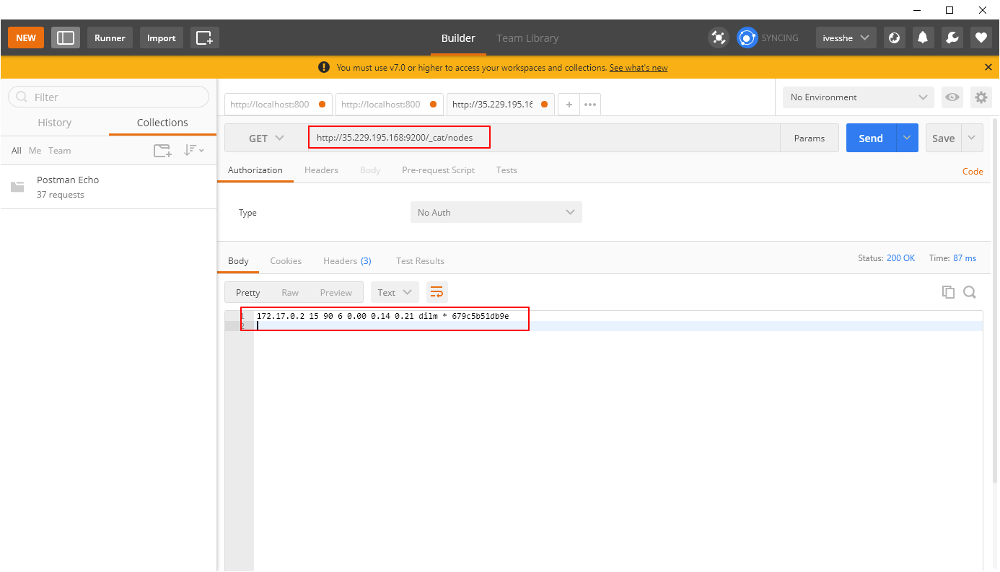
# 創建實例-安裝Kibana

Kibana為可視化操作介面

```bash
docker run --name kibana -e ELASTICSEARCH_URL=http://35.229.195.168:9200 -p 5601:5601 \
-d kibana:7.4.2
```


**開啟GCP防火牆5601端口**

這邊其實碰到不少問題

無法訪問


查看docker日誌，發現訪問elasticsearch失敗

```bash
docker logs 容器id
```

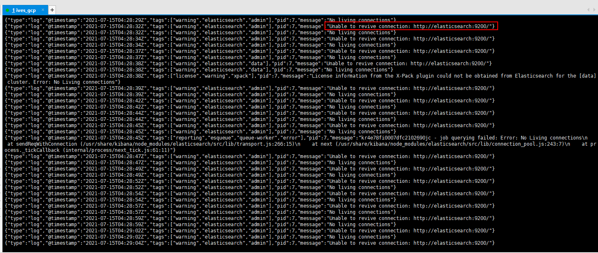

查看kibana docker容器的elasticsearch ip

```bash
docker inspect --format '{{ .NetworkSettings.IPAddress }}'  es容器ID
```

發現是docker的容器內部ip


進入容器內部，修改kibana.yml檔

```bash
docker exec -it 710667046a62 /bin/bash
cd kibana/config
vi kibana.yml
```

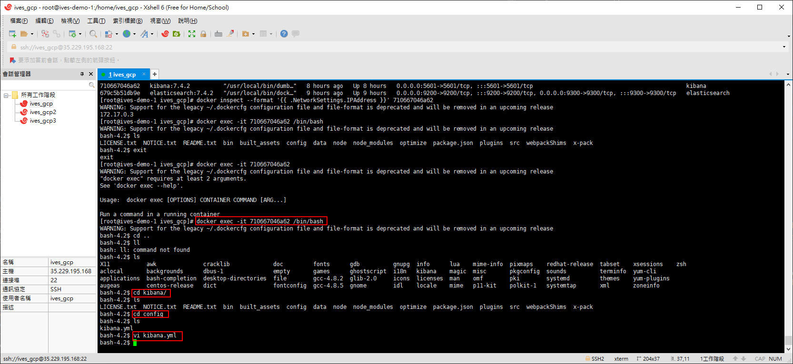

修改elasticsearch的ip為真實ip

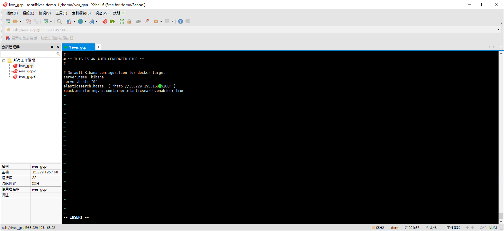

再重新訪問，可以訪問kibana了!!!


進行設定


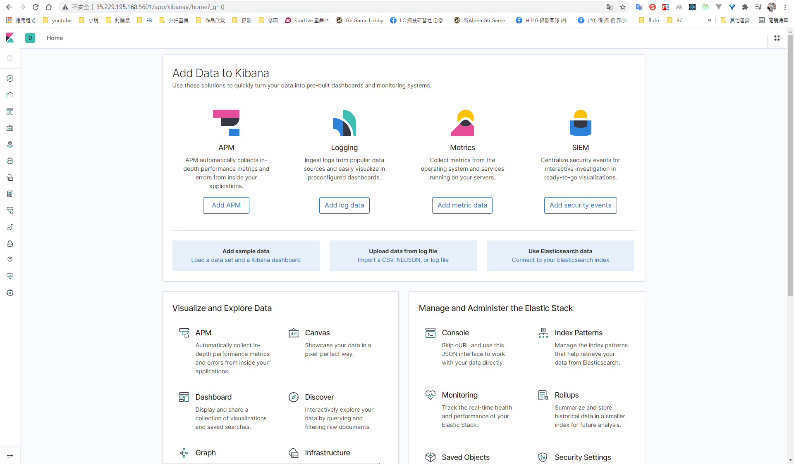

# elasticsearch 初步檢索

## 查詢elasticsearch健康狀態

http://35.229.195.168:9200/_cat/health

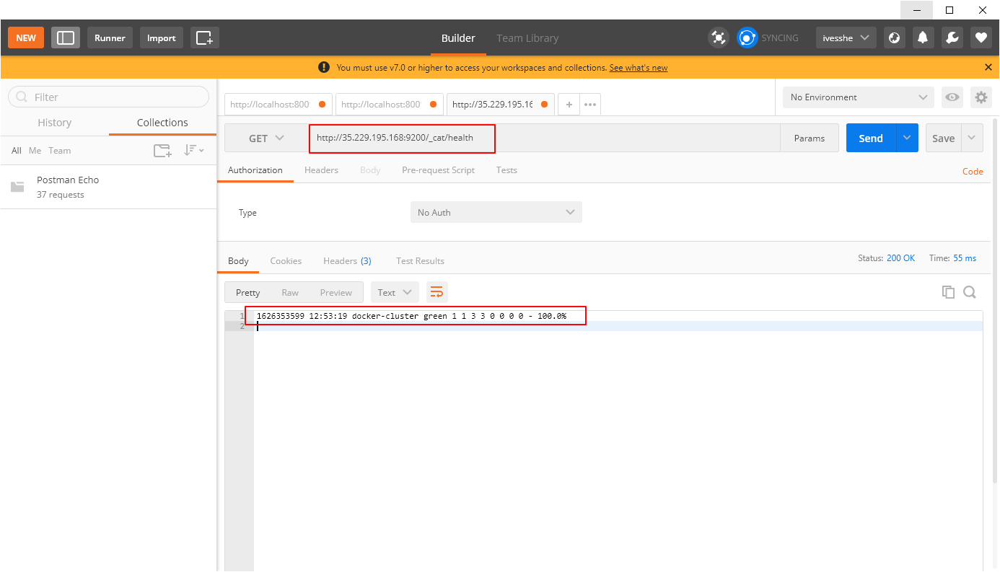

## 查看主節點

http://35.229.195.168:9200/_cat/master


## 查看所有索引

http://35.229.195.168:9200/_cat/indices

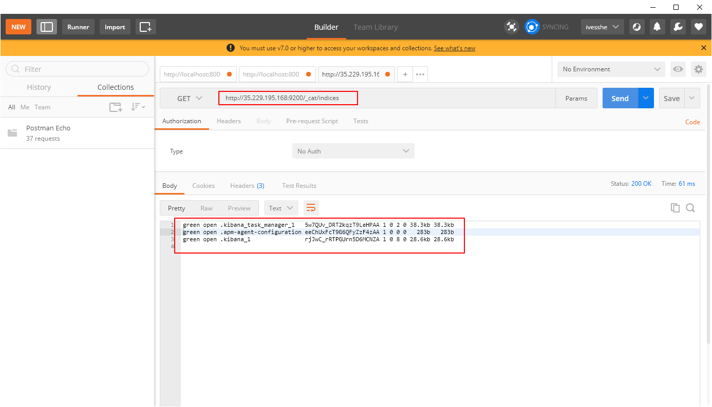